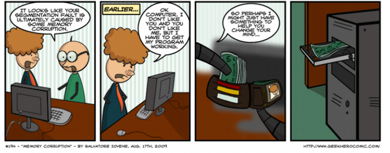

# appsec_course

Supports de cours
- étudiants option cybersécurité à l'IMT Atlantique
- étudiants epitech

## license
Ces supports sont disponibles en licence CC-BY-ND

## contenus

- partie 1 : [généralités sur la cyber](Appsec_1.pdf)
- partie 2 : [sécurité applicative / web](Appsec_2.pdf)
- partie 3 : [sécurité bas niveau / rust](Appsec_3.pdf)

Un [projet honeypot](honeypot.md) vient finaliser ce cours. 

## questionnaire de satisfaction

merci de remplir le [questionnaire](https://forms.gle/2QJgz1JrnRbRJSce9)
